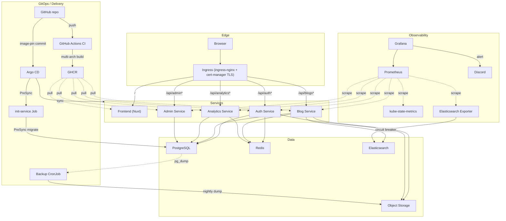

# ManKahi

[](https://github.com/Aman-Agnihotri/Man-Kahi---Blogging-System/actions/workflows/ci.yml)

**Live at [mankahi.xyz](https://mankahi.xyz/)** — a production two-node arm64 k3s cluster engineered to fit entirely within Oracle Cloud's Always Free tier: twelve services memory-budgeted into 6 GiB, multi-arch images, TLS, and private object storage. (mankahi.work.gd redirects here.)

<!-- Numbers verified at HEAD e9a120b: 12 = long-running Deployments excluding init Job; 419 = 10+113+145+17+97+37 (shared+blog+auth+analytics+admin+frontend tests); 5312Mi via verify-memory-budget.py -->
**12 services · 5312/6144 MiB · 2× arm64 A1 nodes · 419 tests · multi-arch · TLS via Let's Encrypt · GitOps (Argo CD) · nightly backups, restore-drilled · runs entirely within Oracle Cloud's Always Free tier ($0/month)**

ManKahi is a blogging platform for writers who want a clean publishing space: markdown posts, searchable stories, author profiles, reader engagement, analytics, and moderation tools.

It's a service-oriented application that runs the same codebase everywhere: Docker Compose on a laptop for development, and a Kubernetes cluster in production — CI-built multi-arch images, Kustomize overlays, TLS via cert-manager/Let's Encrypt, and private object storage served through presigned URLs.



## Features

### Publishing

Markdown-based posts with title, slug, content, cover image, tags, categories, excerpt, and SEO fields (meta title/description/canonical URL). Every post keeps both its raw markdown and rendered HTML, so re-opening it for editing shows clean markdown. Every edit is captured as a revision, viewable and restorable from the editor.

### Discovery

Full-text search backed by Elasticsearch, filterable by category and tags, with a trending-posts feed, related-post suggestions, and pagination — and a circuit breaker that keeps search endpoints answering (as an empty result) rather than failing when Elasticsearch is down. Redis caches hot reads.

### Reader Engagement

Likes, bookmarks, threaded (one level) comments, reading-progress tracking, and share links.

### Accounts and Social

Local login plus an optional Google OAuth path — connect or disconnect Google from account settings (with lockout protection so you can never remove your only sign-in method) — password reset, avatar upload, bio and social links, following other authors, notification preferences, and self-service account deletion.

### Analytics

Tracks views, reads, reading progress, and link clicks per post, plus platform-wide and trending stats.

### Moderation

Admins can hide/unhide or hard-delete posts, suspend/unsuspend users (enforced at login), assign/revoke roles, review and resolve reported content, and manage the category catalog. Every moderation action is recorded in a searchable audit log.

### Observability and Ops

Structured, service-tagged, secret-redacted logging with request IDs; Prometheus metrics with auto-provisioned Grafana dashboards; Prometheus alert rules delivered to Discord via Grafana alerting, and an operational runbook (backups, restore drills, incident convention).

## Architecture

ManKahi is a service-oriented application:

```text
Browser
  -> Gateway (Nginx in dev / ingress-nginx + TLS in production)
  -> Nuxt frontend
  -> Auth, Blog, Analytics, and Admin services
  -> PostgreSQL, Redis, Elasticsearch, and object storage
```

In development, an Nginx gateway fronts everything; in production, ingress-nginx terminates TLS (cert-manager + Let's Encrypt) and routes `/api/*` prefixes to the backend services and `/` to the frontend. Only the ingress is public; every backing service stays private. Read the full architecture notes in [docs/architecture.md](docs/architecture.md).

## Repository layout

| Path | Role |
|---|---|
| `frontend/` | Nuxt 3 frontend |
| `backend/{auth,blog,analytics,admin,init}-service/` | Backend microservices |
| `backend/shared/` | Shared library (Prisma schema, config, middlewares, utils) used by all backend services |
| `docker/` | Docker Compose stack — the local dev environment (dev + production variants) |
| `kubernetes/base/` | Kustomize base app manifests |
| `kubernetes/environments/` | Kustomize overlays: development/, production/, and oci/ — the live production overlay (SHA-pinned images, resource budget, TLS ingress) |
| `kubernetes/platform/` | Cluster platform components: ingress-nginx (vendored, pinned), cert-manager issuers, Argo CD app-of-apps, sealed-secrets, NetworkPolicies, backups |
| `terraform/` | OCI infrastructure (VCN, two A1.Flex nodes, object storage) — applied and live |
| `.github/workflows/` | CI: tests + multi-arch images to GHCR + Trivy scans |
| `docs/` | Project documentation |

## Tech Stack

- **Frontend:** Nuxt 3 (Vue), Tailwind CSS
- **Backend:** Node.js/TypeScript microservices (auth, blog, analytics, admin), Express, Prisma
- **Data:** PostgreSQL, Redis, Elasticsearch
- **Gateway:** Nginx (dev) / ingress-nginx + cert-manager (production)
- **Observability:** Prometheus, Grafana, Pino structured logging
- **Infra:** Docker Compose (dev), k3s on OCI Always Free (production) with Kustomize overlays, Terraform-provisioned infrastructure, GitHub Actions CI → GHCR (multi-arch), cert-manager + Let's Encrypt TLS
- **Object storage:** MinIO locally; OCI Object Storage (S3-compatible) in production — private buckets, reads served via presigned URLs

## Getting Started

The stack runs locally via Docker Compose:

```bash
cd docker/compose
docker compose up -d --build
```

Once running, use the gateway:

```text
http://localhost:8080
```

To share it on a temporary public link without any real deployment, point a Cloudflare quick tunnel at the gateway:

```bash
docker run --rm cloudflare/cloudflared:latest tunnel --url http://host.docker.internal:8080
```

Cloudflare prints a public `https://*.trycloudflare.com` URL that proxies straight to nginx. It's temporary and disappears when the container stops.

### Production

The production deployment runs on a two-node k3s cluster on OCI's Always Free tier, deployed from the `kubernetes/environments/oci` overlay. The full story — infrastructure provisioning, image pinning, first-deploy order, TLS, and object storage — lives in [docs/oci-deployment.md](docs/oci-deployment.md). Deployments run on GitOps (Argo CD) — see [docs/gitops.md](docs/gitops.md).

Local setup and environment configuration live in [docs/local-development.md](docs/local-development.md).

How a change ships:

```text
git push → CI (tests gate) → multi-arch build amd64+arm64 → GHCR (SHA-tagged) → image-pin commit → Argo CD sync → live
# merge → cluster ≈ 3 min
```

See [docs/ci.md](docs/ci.md) for the build pipeline and [docs/gitops.md](docs/gitops.md) for how Argo CD keeps the cluster in sync, with the merge-to-live timing noted in [docs/operations.md](docs/operations.md).

## Documentation

- [Architecture](docs/architecture.md)
- [Local development](docs/local-development.md)
- [OCI Production Deployment](docs/oci-deployment.md)
- [CI Pipeline](docs/ci.md)
- [Resilience](docs/resilience.md)
- [Scaling](docs/scaling.md)
- [Alerting](docs/alerting.md)
- [Compose operations](docs/local-operations.md)
- [Operations runbook](docs/operations.md)
- [GitOps](docs/gitops.md)
- [Docs index](docs/README.md)
